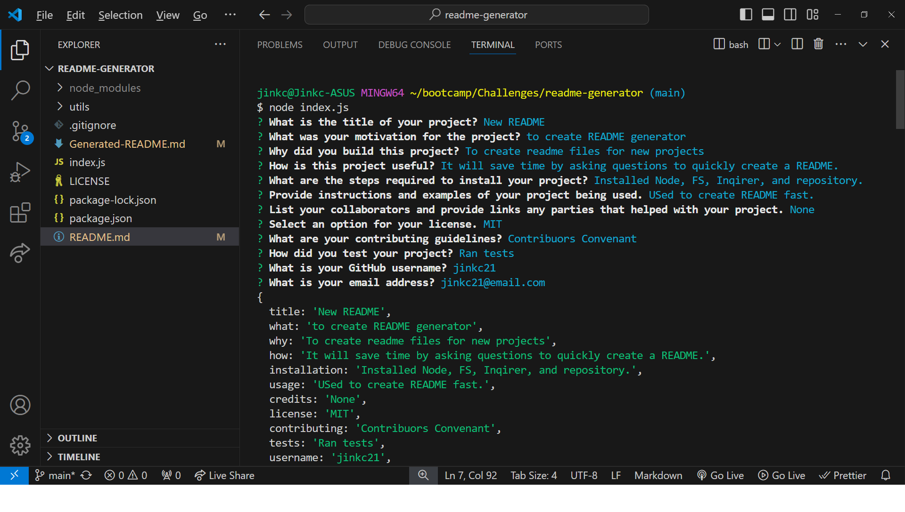

# Professional README Generator

## Description
Creating a professional README can be time consuming.
We needed a way to create README’s for projects easier and more efficient.
This README Generator allows users to quickly generate README files for their new projects.

## Table of Contents

- [Installation](#installation)
- [Usage](#usage)
- [Credits](#credits)
- [License](#license)
- [Contributing](#contributing)
- [Tests](#tests)
- [Questions](#questions)

## Installation
To install this project, users must first download Node.js. Users must also download the repository for the README generator at: 
git@github.com:jinkc21/readme-generator.git 
Inside the README Generator’s terminal  users will then install inquirer and fs by using the following commands in the command line: “npm install inquirer@8.2.4” and “npm install fs”. Once files are installed, users can then use the command: “node index.js”, to start the application.

## Usage
Once the application is started, a series of questions will be prompted. The first question is the title and is required. The rest of the sections are optional, but will be left blank if no input is entered.  Once the questions are complete, the new README will be generated as “Generated-README.md”.

For a tutorial on how to install and use the application, please visit this link:
https://drive.google.com/file/d/1ZLoT7B8alRq5oFp0zx_rSRHkpZCqLGNQ/view

## Credits
The Professional README Template from the Full-Stack Blog was used to create the README layout. The documentation for Inquirer at NPMJS was used to create the questions. Erik Hoversten provided assistance with startup code to pass the data.
 https://coding-boot-camp.github.io/full-stack/github/professional-readme-guide 
 https://www.npmjs.com/package/inquirer/v/8.2.4 

## License
License: MIT

https://choosealicense.com/licenses/MIT/

## Contributing

## Tests
This project was tested during development. No additional tests have been created for this project.

## Questions
For any questions regarding this project, contact links are listed below.

GitHub: https://github.com/Jinkc21

email: jinch0e@hotmail.com
